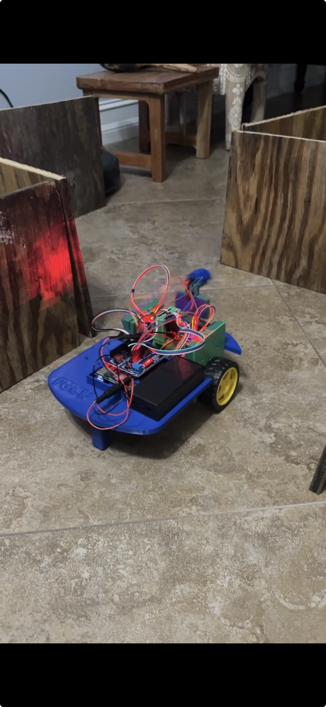

# Rover — Autonomous Maze-Navigating Robot

An Arduino-based autonomous robot that navigates mazes using ultrasonic sensing and a state-machine control loop. Built for the FGCU Computing & Software Engineering program.



## What It Does

The rover drives itself through a maze without human input. A servo-mounted ultrasonic sensor sweeps left, front, and right to measure distances in real time. The robot uses those readings to:

- Move forward along open corridors
- Hug the nearest wall (left or right) using proportional correction to stay centered
- Detect dead ends and decide whether to turn left or turn right
- Stop and declare itself stuck if no path is available
- Perform a victory dance when it reaches the end (front distance reads zero)

## Hardware

| Component | Details |
|-----------|---------|
| Microcontroller | Arduino (compatible with Uno/Nano) |
| Drive motors | 2× 28BYJ-48 stepper motors (2:1 gear ratio) |
| Motor driver | 4-pin ULN2003 boards |
| Distance sensor | HC-SR04 ultrasonic (Trig: A4, Echo: A5) |
| Servo | Controls sensor sweep direction (pin 9) |
| IR receiver | Pin 3 (remote control, reserved for future use) |

## Software Architecture

### `Motor.h`
A thin wrapper around the `AccelStepper` library that adds:
- Motor inversion (right motor is physically mounted backwards)
- Gear-ratio scaling
- Convenience `forward(speed, scale)` / `reverse(speed, scale)` methods that express movement in whole or fractional wheel rotations

### `RobotMain.ino`
State-machine control loop running at 500 ms intervals:

```
START → MOVING → CHECK_TURN → TURN_LEFT / TURN_RIGHT → MOVING → ...
                                                       → STUCK
                                                       → FINISH → EXIT
```

The main `loop()` runs the stepper motors every cycle for smooth motion while the timed control loop handles sensing and state transitions independently (non-blocking design).

## Dependencies

Install these libraries via the Arduino Library Manager before compiling:

- **AccelStepper** — multi-motor stepping without blocking delays
- **Servo** — standard Arduino servo library (bundled with the IDE)

## Building & Uploading

1. Open `RobotMain.ino` in the Arduino IDE.
2. Install the dependencies listed above.
3. Select your board and COM port.
4. Upload.

To enable serial debug output, uncomment `#define __DEBUG` at the top of `RobotMain.ino` and open the Serial Monitor at **115200 baud**.

## Tuning

| Constant | Location | Purpose |
|----------|----------|---------|
| `BASESPEED` | `RobotMain.ino` | Base stepper speed (steps/sec); max 2000 |
| `distFromWall` | `followLeftWall` / `followRightWall` | Target wall-following distance in cm |
| `CONTROL_INTERVAL` | `RobotMain.ino` | How often the control loop runs (ms) |
| `FRONTANGLE` / `LEFTANGLE` / `RIGHTANGLE` | `RobotMain.ino` | Servo sweep angles for sensor directions |
